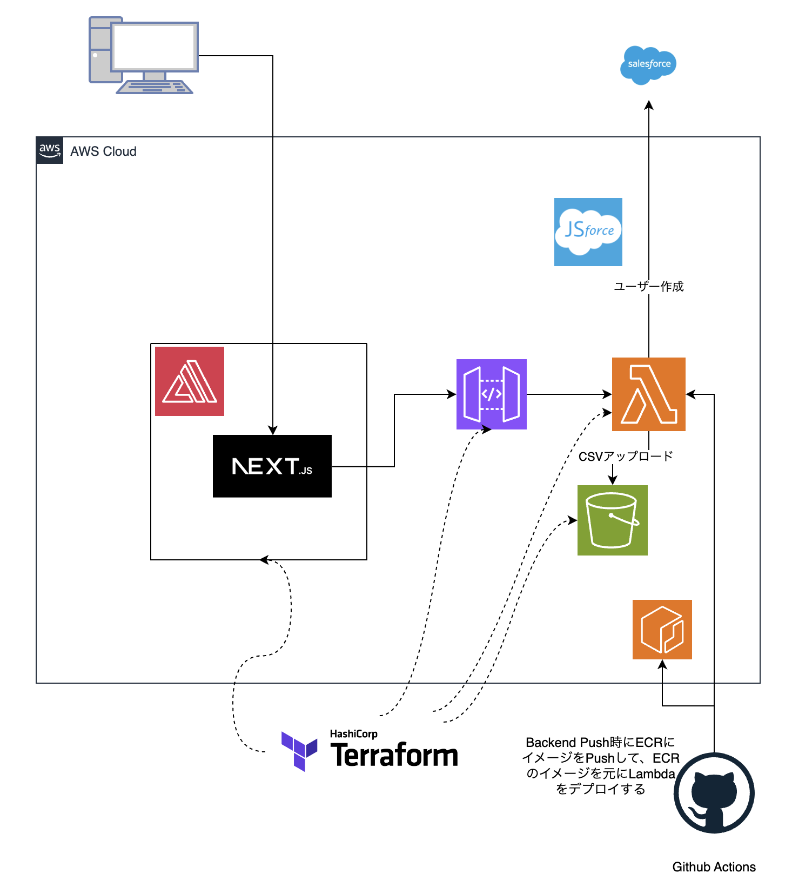

## 構成



## How to Development

### backend

- [参考](https://dev.to/ichintansoni/nodejs-typescript-getting-started-35j7)

```sh
# install typescript
npm install -D typescript

# create tsconfig.json
npx tsc --init
```

### Add new path in API Gate way

```sh
resource "aws_api_gateway_rest_api" "api" {
    ...
    # paths に追加する
    paths = {
      "/sample" = {
        get = {
          x-amazon-apigateway-integration = {
            httpMethod           = "POST" # LambdaへのアクセスはPOSTでないといけないらしい
            payloadFormatVersion = "1.0"
            type                 = "AWS_PROXY"
            uri                  = var.lambda_invoke_arn
            credentials          = aws_iam_role.api_gateway_role.arn
          }
        }
      }
    }
  })
}
```
